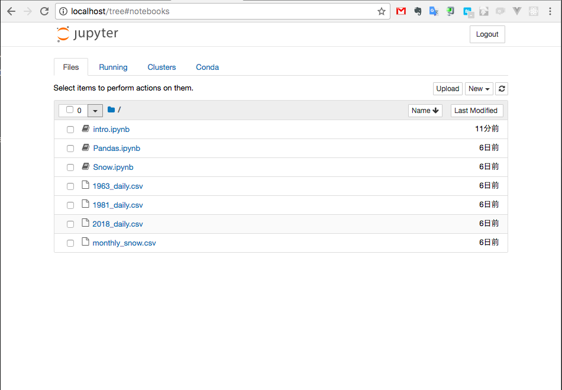
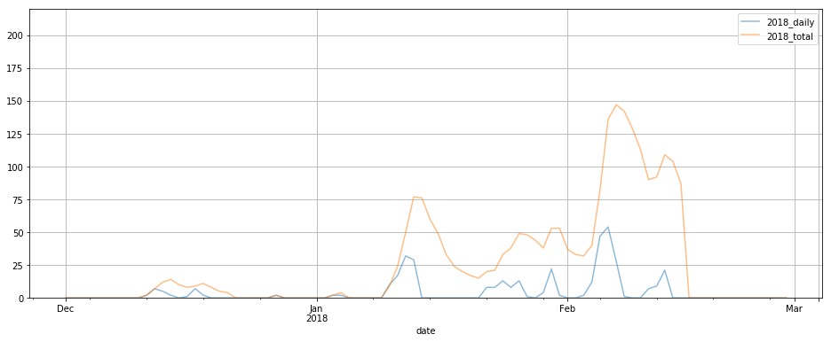

<div style="font-size: 0.89em;">
<h1>Jupyter Notebook 入門</h1>
</div>

## はんなりPython #3

### 2018/02/16

---

## 自己紹介

### 森崎雅之

### @masayuki14


Follow me !!

---

## 自己紹介

- コミュニティ
    - はんなりPython
    - OSS Gate
- 主夫
    - 兼 パートタイムプログラマ
    - 兼 スプーキーズアンバサダー

---

## スプーキーズ@京都

### ソーシャルゲーム ✕ ボードゲーム

<a href="http://spookies.co.jp/">

</a>

---

## スプーキーズ@京都

### 社内勉強会やってます

- WebRTCを活用する
- Docker勉強会
- ゲームAIを作って競い合う構想

---

## スプーキーズ@京都

### エンジニア勉強会 #1　3/23(金)

[connpass 79323](https://connpass.com/event/79323/)

---

## スプーキーズ@京都

### Webエンジニア募集中

---

## 今日する話

<div style="font-size: 0.89em;">
<h1>Jupyter Notebook 入門</h1>
</div>

---

## 今日する話

### Jupyter Notebook とは
### Use Jupyter Notebook
### Use Pandas
### 身近なデータを可視化

---

## Jupyter Notebook とは

---

## Jupyter Notebook とは

### Project Jupyter

複数のプログラミング言語にまたがるインタラクティブコンピューティングのためのサービスを開発する

---

## Jupyter Notebook とは

### Project Jupyter のサービスの一つ

ライブコード、方程式、可視化、テキストを含むドキュメントを作成して共有できるオープンソースのWebアプリケーション

---

## Use Jupyter Notebook

---

## Use Jupyter Notebook

### by Docker

```
FROM python:latest

# Install miniconda to /miniconda
RUN curl -LO 'https://repo.continuum.io/miniconda/Miniconda3-latest-Linux-x86_64.sh'
RUN bash Miniconda3-latest-Linux-x86_64.sh -b -p /miniconda
ENV PATH=/miniconda/bin:${PATH}
RUN conda update -y conda

# install for jupyter notebook
RUN conda install -y pandas matplotlib nb_conda
RUN conda install -y pyyaml

RUN mkdir -p /root/notebook
WORKDIR /root/notebook

CMD jupyter notebook --ip=0.0.0.0 --allow-root
```
@[1](ベースにpythonの最新バージョン)
@[3-7](Minicondaをインストール)
@[9-11](必要なライブラリをインストール)
@[13-16](jupyterを実行してWebサーバーを起動)

---

## Use Jupyter Notebook

Build image

```
$ docker build -t jupyter .
```

Run docker

```
$ docker run -it --rm -v $(pwd)/notebook:/root/notebook -p 80:8888 jupyter
```

---

## Use Jupyter Notebook

```
Copy/paste this URL into your browser when you connect for the first time,
to login with a token:
    http://0.0.0.0:8888/?token=ba4fc6de0d99161f5e144ad4c1167ebf074ddc29b916065f
```

---

## Use Jupyter Notebook

http://localhost/?token=ba4fc6de0d99161f5e144ad4c1167ebf074ddc29b916065f

にアクセス！！

---

## Use Jupyter Notebook



---

## Use Jupyter Notebook

### Hello world

```python
def hello():
    return 'Hello Jupyter.'

hello()
```

```python
'Hello Jupyter.'
```

---

## Use Jupyter Notebook

### グラフ表示

```python
# グラフ表示を有効化
%matplotlib inline
import pandas as pd

df = pd.DataFrame([1,1,2,3,5,8,13,21,34,55,89,144,233,377,610,987,1597,2584,4181,6765])
df.plot()
```


---

## Use Jupyter Notebook

### グラフ表示

```python
fibo_pd.describe()
```


---

## Use Jupyter Notebook

### Markdown

- Markdownでメモなどを残せる

- LaTeXで数式を書ける

---

## Use Jupyter Notebook

### Notebook URL

https://github.com/masayuki14/reserve-docs/blob/master/slide/jupyter-notebook/notebook/intro.ipynb

保存した `ipynb` をGitHubにPushすると表示できる。

---

## Use Pandas

---

## Use Pandas

- 1次元データ構造のシリーズ（Series）
- 2次元データ構造のデータフレーム（DataFrame）

---

## Use Pandas

Pandasをつかおう

```python
import pandas as pd
```

---

## Use Pandas

### データフレームの基本的な使い方

```python
In [1]: import pandas as pd
   ...:
   ...: # columnsオプションで列名を指定
   ...: df = pd.DataFrame([1,2,3],
   ...:                  columns=['value'])
   ...: df
```

```python
Out[1]:
   value
0      1
1      2
2      3
```

---

## Use Pandas

### タプルで配列を渡す

```python
In [2]: df = pd.DataFrame([
   ...:     ('apple', 100), ('oragne', 230), ('grape', 290), ('banana', 100)],
   ...:     columns=['name', 'price']
   ...: )
   ...: df
```

```python
Out[2]:
     name  price
0   apple    100
1  oragne    230
2   grape    290
3  banana    100
```

---

## Use Pandas

### ディクショナリで配列を渡す

```python
In [3]: df = pd.DataFrame({
   ...:     'name': ['apple', 'orange', 'pear', 'peach'],
   ...:     'price': [120, 150, 230, 360],
   ...:     'order': [3, 8, 4, 5]
   ...: })
   ...: df
```

```python
Out[3]:
     name  order  price
0   apple      3    120
1  orange      8    150
2    pear      4    230
3   peach      5    360
```

---


## Use Pandas

### 列の追加

```python
In [4]: df['color'] = ['red', 'orange', 'green', 'pink']
   ...: df['total'] = df['order'] * df['price']
   ...: df
```

```python
Out[4]:
     name  order  price   color  total
0   apple      3    120     red    360
1  orange      8    150  orange   1200
2    pear      4    230   green    920
3   peach      5    360    pink   1800
```

---

## Use Pandas

### インデックスの追加

```python
In [5]: df.index = ['Apple', 'Orange', 'Pear', 'Peach']
   ...: df
```

```python
Out[5]:
          name  order  price   color  total
Apple    apple      3    120     red    360
Orange  orange      8    150  orange   1200
Pear      pear      4    230   green    920
Peach    peach      5    360    pink   1800
```

---

## Use Pandas

### 列の選択

```python
In [6]: df['price']
```

```python
Out[6]:
Apple     120
Orange    150
Pear      230
Peach     360
Name: price, dtype: int64
```

---

## Use Pandas

### 列の選択（複数）

```python
In [7]: df[['price', 'color']]
```

```python
Out[7]:
        price   color
Apple     120     red
Orange    150  orange
Pear      230   green
Peach     360    pink
```

---

## Use Pandas

### head, tail

```python
In [8]: df.head(2)
```

```python
Out[8]:
          name  order  price   color  total
Apple    apple      3    120     red    360
Orange  orange      8    150  orange   1200
```

---

## Use Pandas

### インデックス指定

```python
In [9]: df.loc[['Apple', 'Pear']]
```

```python
In [9]: df[1:3]

Out[9]:
          name  order  price   color  total
Orange  orange      8    150  orange   1200
Pear      pear      4    230   green    920
```

---

## Use Pandas

### 条件による指定

```python
In [10]: df[df.price > 200]
```

```python
Out[10]:
        name  order  price  color  total
Pear    pear      4    230  green    920
Peach  peach      5    360   pink   1800
```

---

## Use Pandas

- 対話的、探索的にデータを操作できる

---

## 身近なデータを可視化

---

## 身近なデータを可視化

### Pandas でデータ操作だけじゃつまらない

---

## 身近なデータを可視化

### そうだ可視化しよう

---

## 身近なデータを可視化

### グラフを書いてみよう


---

## 身近なデータを可視化

### 今年は雪が多い

---


---

## 身近なデータを可視化

### 昭和38年、昭和56年と比較する

---

## 身近なデータを可視化

### 気象庁の観測データをダウンロード

http://www.data.jma.go.jp/gmd/risk/obsdl/index.php

---

## 身近なデータを可視化

### 最深積雪をグラフにする

---

## 身近なデータを可視化

### 年別の最深積雪


---

## 身近なデータを可視化

### 昭和38年 (1963年)


---

## 身近なデータを可視化

### 昭和56年 (1981年)


---

## 身近なデータを可視化

### 平成30年 (2018年)



---

## まとめ

Jupyter Notebook を使うことは

データサイエンスのはじめの一歩

---

## ありがとうございました
