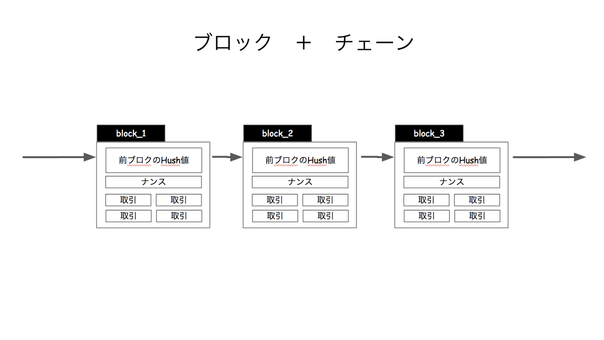

# MySQL8.0 使いたいからブロックチェーン実装してみた

author
:   @masayuki14

theme
:   blue-bar


# 目次

- 自己紹介
- 概要
- 簡易モデル
- 実行環境
- まとめ


# 自己紹介

- 森崎雅之

- @masayuki14

{:width='120'}

{:width='120'}

{:width='120'}

Follow me !!


# 自己紹介

- コミュニティ
    - はんなりPython
    - OSS Gate

- 主夫
    - フリーランス（パート）
    - スプーキーズアンバサダー

# 自己紹介

スプーキーズアンバサダー

- 勉強会開催
- 登壇
- 会社紹介

# スプーキーズ

- Webシステム
- ソーシャルゲーム
- ボードゲーム

**クリエイター募集中！！**

# スプーキーズ

遊びに来てください

- [テクテクテック#5](https://spookies.connpass.com/event/88611/) 9/14 (Fri)
- フリーランスを集めて働き方紹介
- 四条烏丸下がったあたり
- 来月引越

# 概要

> MySQLを8.0を使って
簡略化したブロックチェーンを
実装した

というはなし

# 概要

使っているもの

- MySQL 8.0
- MySQL Shell
- Javascript

# 概要

MySQL 8.0
:   - ブロックのモデルをテーブルで表現
    - トランザクションはJSON
    - HashはMD5で計算

MySQL 8.0 だとJSONをいい感じに扱える

# 概要

MySQL Shell

:   - MySQLのCLIクライアント
    - DBアクセスのインタフェース
    - JavascriptでDBを操作が可能

# 概要

Javascript

:   - マイニングプログラム
    - MySQL Shellで実行


# 簡易モデル

ブロックチェーンの基本的な構造

```
出典: https://www.newscrypto.jp/articles/7487
```

# 簡易モデル

{:width='1800'}


# 簡易モデル

構成要素

:   - 取引(トランザクション)
    - ナンス(乱数)
    - 前のブロックのHash値


# 簡易モデル


マイニング

:   - 生成するHash値に制約
    - ナンスを探すこと

# 簡易モデル

ex) Hash値は先頭に0が10個ないといけない！

```
value = hash( transaction, prev_hash, nonce)

# => 00000000004b2a76b9719d911017c592
# md5 32桁
```

*nonce* を探せ！


# 実行環境

MySQLでブロックチェーンを表現する

- ブロック => Record
- ブロックチェーン => Table

# 実行環境


```
CREATE TABLE `block` (
  `id` int(11) NOT NULL AUTO_INCREMENT,
  `transaction` json DEFAULT NULL,
  `nonce` int(11) DEFAULT NULL,
  `prev_hash` varchar(32) DEFAULT NULL,
  `hash` varchar(32) DEFAULT NULL,
  PRIMARY KEY (`id`)
) ENGINE=InnoDB
```
{: lang="sql" }


# 実行環境

例えばこんな Transaction

```
[
  {"name": "miyake", "date": "2018-04-01",
     "report": "今日は良い天気でした。"},
  {"name": "kataoka", "date": "2018-04-01",
     "report": "チョコレートが美味しかった。"},
  {"name": "tamamura", "date": "2018-04-01",
     "report": "電車が遅れて最悪だった。"}
]
```
{: lang="json" }


# 実行環境

```
mysql> select * from block \G
*************************** 1. row ***************************
         id: 1
transaction: [
  {"date": "2018-04-01", "name": "miyake",
    "report": "今日は良い天気でした。"},
  {"date": "2018-04-01", "name": "kataoka",
    "report": "チョコレートが美味しかった。"},
  {"date": "2018-04-01", "name": "tamamura",
    "report": "電車が遅れて最悪だった。"}
]
      nonce: NULL
  prev_hash: NULL
       hash: NULL
```

# 実行環境

マイニングしてみましょう
:   - Hash関数はMD5
    - 先頭に0が4つ
    - Javascript


# 実行環境

```
shell.connect('mysqlx://root@localhost')
schema = session.getSchema('blockchain')
table = schema.getTable('block')

target_id = 1
record = table.select().
  where('id = :id').bind('id', target_id).
  execute().fetchOne()

nonce = 0
while (true) {
  nonce++
  hash = md5(record.transaction + nonce + record.prev_hash)

  // 条件に一致するHash値になれば終了
  if (hash.match(/^0000/)) {
    table.update().
      set('hash', hash).
      set('nonce', nonce).
      where('id = :id').bind('id', record.id).
      execute()
    break
  }
}
```
{: lang="js" }


# 実行環境


```
$ time mysqlsh -f mining.js
Please provide the password for 'mysqlx://root@localhost': ****

    15326,
    "0000f14b8733a412a00a17abc1b7d3e7"

0.71user 0.03system 0:03.06elapsed 24%CPU (0avgtext+0avgdata 26956maxresident)k
240inputs+0outputs (0major+4062minor)pagefaults 0swaps
```

# 実行環境

制約を変えてハッシュを再計算する

```
$ time mysqlsh -f remining.js
Please provide the password for 'mysqlx://root@localhost': ****
{
    "hash": "00073e18bd64f8ca6a962cb960b65f77",
    "id": 1,
    "nonce": 1235
}
{
    "hash": "000223efef2ccb12da07574967292841",
    "id": 2,
    "nonce": 704
}
{
    "hash": "00058c18fc3f5e38ba0319ce27525a22",
    "id": 3,
    "nonce": 369
}
{
    "hash": "00000015c2b4d2395443e5eb94245794",
    "id": 4,
    "nonce": 1931
}
0.41user 0.02system 0:02.31elapsed 19%CPU (0avgtext+0avgdata 27624maxresident)k
0inputs+0outputs (0major+4162minor)pagefaults 0swaps

```

# 実行環境

先頭の0を増やすほど時間がかかる。

*デモ！！*


# おまけ

transaction を見やすくする *JSON_TABLE()*

```
select id, trans.*
from block, JSON_TABLE(
  `transaction`,
  '$[*]'
  columns (
    name varchar(32) path '$.name',
    `date` date path '$.date',
    report varchar(128) path '$.report'
  )
) trans;
```
{: lang="sql" }


# おまけ

```
+----+----------+------------+-----------------------------------------------------------------------------+
| id | name     | date       | report                                                                      |
+----+----------+------------+-----------------------------------------------------------------------------+
|  1 | miyake   | 2018-04-01 | 今日は良い天気でした。                                                      |
|  1 | kataoka  | 2018-04-01 | チョコレートが美味しかった。                                                |
|  1 | tamamura | 2018-04-01 | 電車が遅れて最悪だった。                                                    |
|  2 | miyake   | 2018-04-02 | 夕立がありすごい雨でした。                                                  |
|  2 | kataoka  | 2018-04-02 | ドーナツならチョコレートがかかっていて欲しい。                              |
|  2 | tamamura | 2018-04-02 | 前を歩くおじさんの傘が刺さりそうで腹がたった。                              |
|  3 | miyake   | 2018-04-03 | 月が綺麗ですね。                                                            |
|  3 | kataoka  | 2018-04-03 | 紅茶ならダージリンが好みだ。チョコレートを添えて。                          |
|  3 | tamamura | 2018-04-03 | 女子高生が歩道に広がって邪魔だった。                                        |
|  3 | kawai    | 2018-04-03 | ストレッチをしたら気持ちよく寝れました。                                    |
|  4 | miyake   | 2018-04-04 | セミが鳴いていたので夏を見つけた気分です。                                  |
|  4 | kataoka  | 2018-04-04 | シフォンケーキにはチョコクリームがとても合う。                              |
|  4 | tamamura | 2018-04-04 | 電車の中でハンバーガー食うなよ。臭うだろ。                                  |
|  4 | kawai    | 2018-04-04 | はじめてランニングハイを感じられました。                                    |
+----+----------+------------+-----------------------------------------------------------------------------+
```

# おまけ

再帰アクセスする *CTE*

```
with recursive
blockchain (id, hash, path)  as (
  select id, hash, cast(id as char(100))
  from block2
  where id = 1
union all
  select b.id, b.hash, concat(b.id, '->', bc.path)
  from blockchain bc join block2 b
  on bc.hash = b.prev_hash
)

select * from blockchain;
```

# おまけ

```
+------+----------------------------------+------------+
| id   | hash                             | path       |
+------+----------------------------------+------------+
|    1 | 00073e18bd64f8ca6a962cb960b65f77 | 1          |
|    2 | 000eec3e66368ca655715136995d1701 | 2->1       |
|    3 | 00058c18fc3f5e38ba0319ce27525a22 | 3->2->1    |
|    4 | 00000015c2b4d2395443e5eb94245794 | 4->3->2->1 |
+------+----------------------------------+------------+
```

# まとめ

- ブロックチェーン自体は簡単なモデル
- ナンスを探すのが大変
- MySQL8.0 イケてる！
