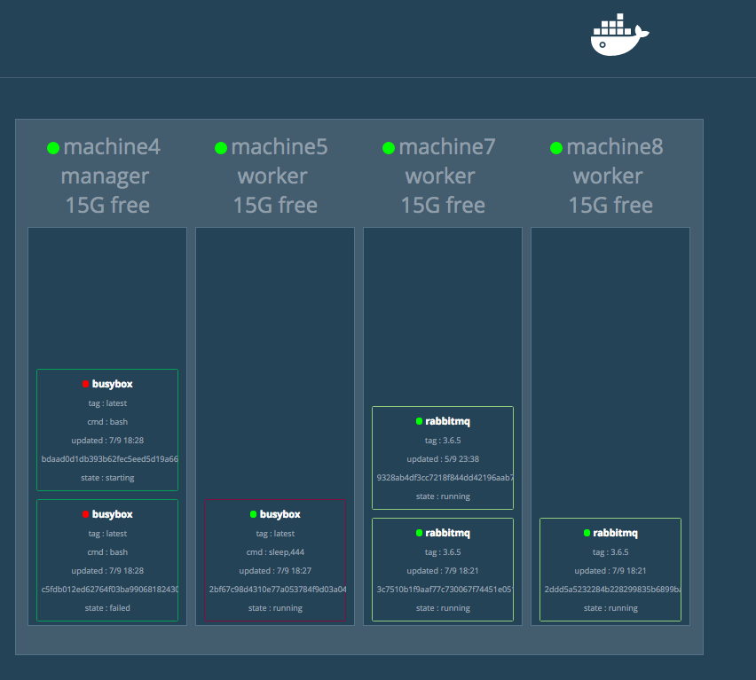

# DockerからKubernetesまでを簡単に紹介

subtitle
:   はんなりPythonの会 #17 令和最初の発表会

date
:   2019/05/17

author
:   @masayuki14

theme
:   blue-bar

allotted-time
:   10m

# Masaといいます

- もりさきまさゆき

- @masayuki14

- プロ主夫
    - フリーランス {::note} (パートタイム) {:/note}
    - ソフトウェアエンジニア
    - データベーススペシャリスト

# このアイコン

\\n
\\n

{: relative_width='40' relative_margin_top='27'}

{:.center}
**Follow me !!**


## プロパティ

background-image
:   ../assets/icon.jpg

background-image-relative-width
:   40

background-image-vertical-align
:   top

background-image-relative-margin-top
:   20

background-image-opacity
:   0.5

# 自己紹介

- コミュニティ
    - はんなりPython {::note} (第3金曜開催@京都) {:/note}
    - OSS Gate {::note} (京都, 大阪, 東京) {:/note}

- スプーキーズアンバサダー

# スプーキーズ@京都

- ボードゲーム制作
- Web系システム
- ソーシャルゲーム開発

{:.center}
**Webエンジニア積極採用中！！**

## プロパティ

background-image
:   ../assets/spookies_logo.png

background-image-relative-width
:   30

background-image-align
:   right

background-image-relative-margin-right
:   3

{::comment}
{:/comment}


# スプーキーズ@京都

もくもく会 [モクモクモック](https://spookies.connpass.com/event/123996/)

勉強会 [テクテクテック](https://goo.gl/hXXafu)

- 2019/07 企画中
    - ISUCONワークショップ - 速度改善
    - CTF - セキュリティ

## プロパティ

background-image
:   ../assets/spookies_logo.png

background-image-relative-width
:   30

background-image-align
:   right

background-image-relative-margin-right
:   3

{::comment}
{:/comment}


# DockerからKubernetesまでを簡単に紹介

# DockerからKubernetesまでを簡単に紹介

- Docker
- Docker Compose
- Docker Swarm
- Kubernetes(k8s)

# Docker

# Dockerの基礎概念

- コンテナ型仮想化技術
- アプリケーションデプロイに特化

# Dockerの基礎概念

{: relative_width='90' }


# Dockerの利点

- 環境の再現性
- 軽量
    - VMより軽い
- 簡易
    - コマンド
    - Dockerfile

# Dockerの利点

JupyterNoteBookの起動

```
$ docker run --rm \
    -p 8888:8888 \
    jupyter/scipy-notebook
```

http://localhost:8888

## jupyter/scipy-notebook

# Dockerの利点

Dockerfileで設定

```
FROM jupyter/scipy-notebook
RUN pip install plotly
RUN pip install pandas
```

# Dockerの利点

ビルドと実行

```
$ docker build -t myjupyter .
$ docker run --rm \
    -p 8888:8888 \
    myjupter
```

# Dockerの苦手なこと

- 複数のコンテナの協調
    - コマンドが長くなる
    - 管理が大変
- **Docker Compose を使おう**

# Docker Compose

# Docker Composeの利点

- 複数のコンテナを扱える
- 元々はFig
- buildと実行を同時に
- docker-compose.yml で設定

# Docker Composeの利点

```
version: '3.7'
services:
  dash:
    build:
      context: ./dash
    ports:
      - 8050:8050

  db:
    image: mysql:8.0
    environment:
      MYSQL_ROOT_PASSWORD: root
    ports:
      - 3306:3306
```

# Docker Composeの利点

```
$ ls
docker-compose.yml

$ docker-compose up
```

Dockerfileのビルドを行って各コンテナを起動


# Docker Compose の苦手なこと

- 単一ホストでの構成
    - 複数ホストで配置できない
- 冗長化できない
- **Docker Swarm を使おう**

# Docker Swarm

# Docker Swarmの利点

- Dockerホストのクラスタ
- コンテナオーケストレーション
    - コンテナ配置(複製・分散)
    - コンテナ間通信
- コンテナのスケール
    - Service, Stack

# Docker Swarmの利点

{: relative_width='75' }

{:.center}
Swarm Cluster

# Docker Swarmの利点

{: relative_height='110' }


# Docker Swarm の苦手なこと

- クラスタ作らないといけない
- コマンド操作が多い
- 管理/運用が煩雑
- **Kubernetes** を使おう

# k8s

{: relative_height='110' }


# k8sの利点

- コンテナオーケストレーション
- コンテナ運用の自動化
- 設定ファイルで運用
- 高機能

# k8sの利点

- Google謹製 OSS (Borg)
- クラウドで使える
    - GKE
    - EKS
    - AKS

# k8sの利点

{: relative_height='110' }

# k8sの苦手なこと

- 学習コスト高い
- エンジニアコストが高い


# まとめ

- Dockerで始める仮想化
- k8s一緒にやりませんか

# 引用

- https://knowledge.sakura.ad.jp/13265/
- https://info.crunchydata.com/blog/an-easy-recipe-for-creating-a-postgresql-cluster-with-docker-swarm

# 引用

- https://github.com/dockersamples/docker-swarm-visualizer
- https://blog.risingstack.com/what-is-kubernetes-how-to-get-started/
