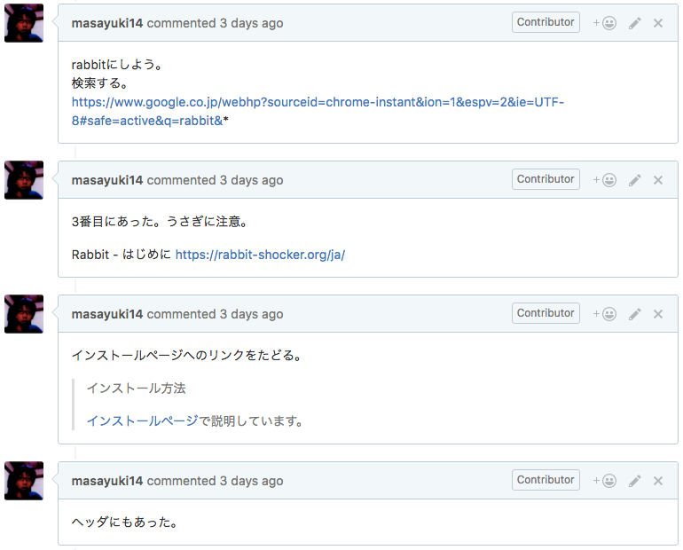
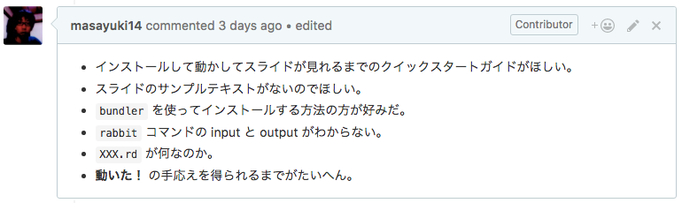
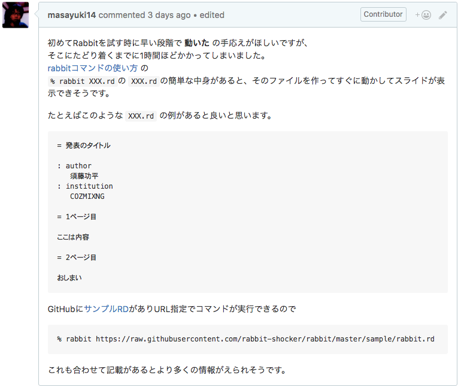
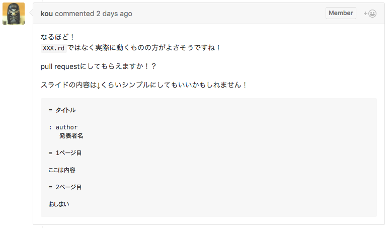
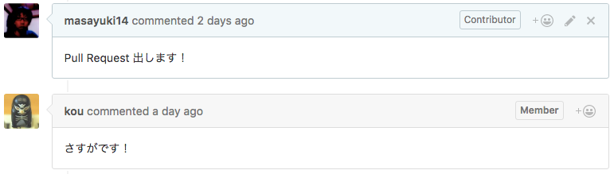
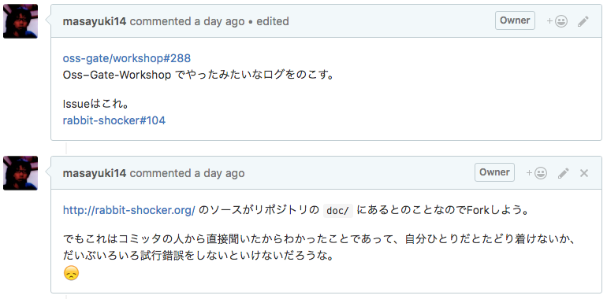
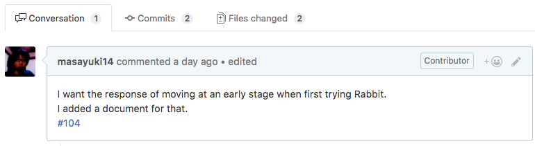
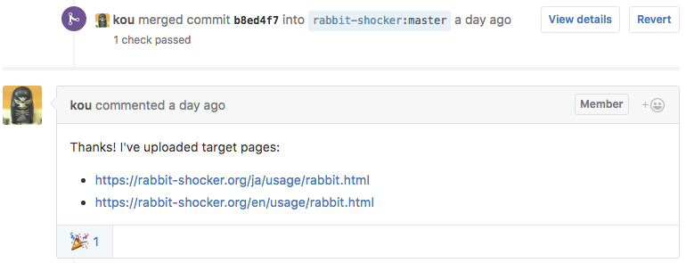
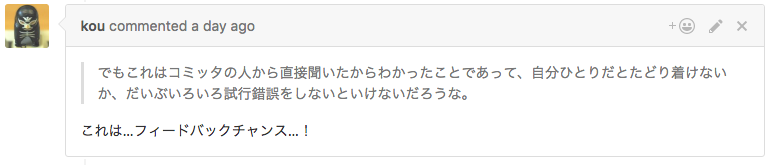

# OSS Gate に参加してきた

author
:   @masayuki14

theme
:   nari

# OSS Gate に参加してきたよ

- [OSS Gate大阪ワークショップ](https://oss-gate.doorkeeper.jp/events/56141)

- 楽しい！とても良い経験

- 同じ体験をする人が増えるといいな

# OSS Gate ってなに？

OSSへの参加・貢献って  

*実はとても敷居が低い*  

それを体験するため

**ワークショップ**

# なにをやってきたの？

ワークショップのプログラムに乗っかった結果
  
*OSSにIssueを提出しました！*

# どうやって？

1. 対象OSSを決める

1. 動かしてみる

1. その時の作業ログを記録

1. フィードバックポイント抽出

1. Issue作成

# 作業ログ

{:height='600'}

# フィードバックポイント抽出

{:width='770'}

# Issue作成

対象のOSS
:   [rabbit](http://rabbit-shocker.org/ja/)

内容
:   ドキュメントに関する改善の提案

Issue
:   [初めてRabbitを試す時に早い段階で **動いた** の手応えがほしい #104](https://github.com/rabbit-shocker/rabbit/issues/104)

# Issue作成

{:width='770'}

# Issue作成

*こんなことでも立派なOSSへの貢献になるんだ！*

# Level Up

OSS開発*未*経験者
                ↓
OSS開発　経験者

# Conversation

{:width='771'}

# Conversation

{:width='771'}

# プルリクを出そう

# プルリクを出そう

同じように作業ログを残す

{:width='770'}

# プルリク出した

[Improve usage doc. #105](https://github.com/rabbit-shocker/rabbit/pull/105)

{:width='770'}

# マージされた

{:width='770'}

# Level Up

OSS開発経験者
                ↓
OSS Contributor

# 怖くないよOSS

- バグを見つけなくてもOK！

- プログラムできなくてOK!

- 初心者ならではの貢献！

- 小さなことでも感謝される!

# 終わらないOSS開発

{:width='770'}

# OSS Gate に参加しよう

- 楽しい経験

- 参加者との交流

- Contributorになれちゃう

