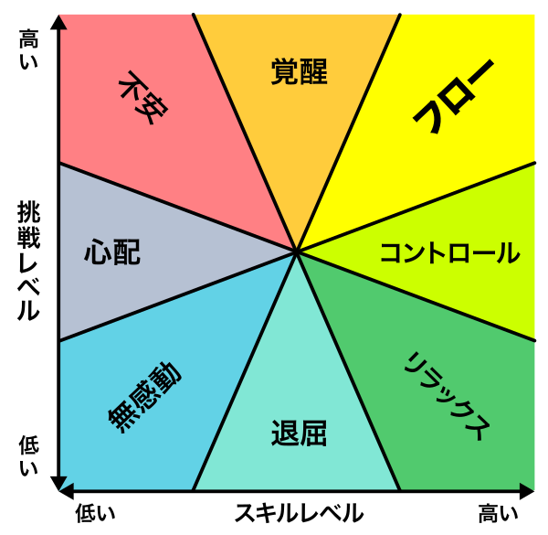
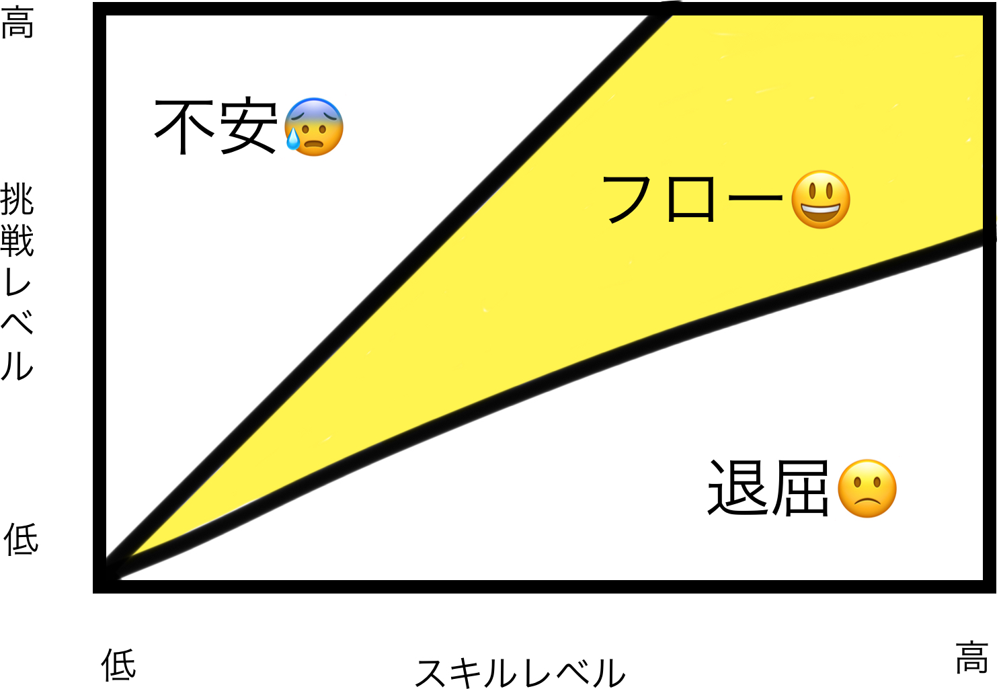

# 個人の学びを続けるために

subtitle
:   はんなりPython#14

date
:   2019/02/15

author
:   @masayuki14

theme
:   clear-blue

allotted-time
:   20m

# 自己紹介

- もりさきまさゆき(Masa)

- @masayuki14

{: relative_width='60' align='left'}

{:.center}
**Follow me !!**

## プロパティ

background-image
:   ../assets/icon.jpg

background-image-relative-width
:   30

background-image-align
:   right

background-image-relative-margin-right
:   3

background-image-opacity
:   0.5

# 自己紹介

- プロ主夫
    - フリーランス {::note} (Web系パートタイム) {:/note}
    - データベーススペシャリスト

- コミュニティ
    - はんなりPython {::note} (第3金曜開催@京都) {:/note}
    - OSS Gate {::note} (京都, 大阪, 東京) {:/note}

- スプーキーズアンバサダー

# スプーキーズ@京都

- Web系システム
- ソーシャルゲーム開発
- ボードゲーム制作

{:.center}
**Webエンジニア積極採用中！！**

## プロパティ

background-image
:   ../assets/spookies_logo.png

background-image-relative-width
:   30

background-image-align
:   right

background-image-relative-margin-right
:   3

{::comment}
{:/comment}

# スプーキーズ@京都

勉強会 [テクテクテック](https://goo.gl/hXXafu)

- 2019/03 予定
    - 1周年記念パーティ

もくもく会 モクモクモック

- 毎週木曜日 19:00〜
    - いつでも来てね!!

## プロパティ

background-image
:   ../assets/spookies_logo.png

background-image-relative-width
:   30

background-image-align
:   right

background-image-relative-margin-right
:   3

{::comment}
{:/comment}

# 今日のお題

{:.center}
{::tag name="x-large"} 個人の学びを続けるために {:/tag}

# 今日のお題

前提

- 個人の活動としての学び方
- 仕事のなかでの学び方ではない
 {::note} 応用はできるかもしれない {:/note}

# .

{:.center}
{::tag name="x-large"} ここはPython勉強会の会場 {:/tag}

# .

{:.center}
{::tag name="x-large"} 学んでいますか？ {:/tag}

# .

{:.center}
{::tag name="x-large"} なぜ学ぶんですか？ {:/tag}

# .

{:.center}
{::tag name="x-large"} なぜここにいるんですか？ {:/tag}

# 学ぶ理由

- {::tag name="large"} なんか面白そう {:/tag}
- {::tag name="large"} なんかできそう {:/tag}

# でも問題が・・・

ありがちな問題
:   - 入門書つまらない問題
    - できるようになって来たら何していいかわからない問題

# でも問題が・・・

資質ないかも問題
:   - 気がついたらプログラミングしてた
    - 努力を努力と思ってない
    - 技術書が大好き

っていうわけじゃない

# .

{:.center}
{::tag name="x-large"} 大丈夫！！ {:/tag}

# .

{:.center}
{::tag name="x-large"} 資質なんていらない {:/tag}

# .

{:.center}
{::note name="x-large"} でもちょっとは要る {:/note}

# How to learn

{:.center}
{::tag name="x-large"} どうやって学ぼう？ {:/tag}

# One of way

{:.center}
{::tag name="x-large"} フロー状態を味方につける {:/tag}

# What's flow ?

チクセントミハイのフロー理論

- 人間がフロー体験を繰り返すことで高度な技量や能力を獲得していく過程を理論化したもの

# フロー状態

> 人間がそのときしていることに、完全に浸り、精力的に集中している感覚に特徴づけられ、完全にのめり込んでいて、その過程が活発さにおいて成功しているような活動における、精神的な状態をいう
{::note} 出典: フリー百科事典『ウィキペディア（Wikipedia）』 {:/note}

# つまり

{:.center}
{::tag name="x-large"} 活動に没入している状態 {:/tag}

# メンタルステート図

{: relative_height='95' }

{::note} 出典: フリー百科事典『ウィキペディア（Wikipedia）』 {:/note}

# 簡易版

{: relative_height='95' }

# フロー状態になるには

{:.center}
{::tag name="x-large"} **ちょっとだけ難しい課題** {:/tag}
\\n
に取り組むと楽しくなり
成長できる。

# なので

- スキルに合わせて難易度を整理
- 意図的にフロー状態になれるような課題
- 自分で設定していく

# (1) 目的を設定

{:.center}
{::tag name="x-large"} **なんか面白そう** {:/tag}
\\n
からはじめる

# (1) 目的を設定

- 何が面白そうだった？
- 何ができたらうれしい？
- 何がワクワクする？

# 見つかったら

{:.center}
{::tag name="x-large"} **それをやる** {:/tag}

# (2) 課題を設定

気にするポイント
:   - 動き出しやすさ
    - モチベーションの高さ

# (2) 課題を設定

ちょっと難しい課題をやる時
:   - 動き出しがちょっと鈍る
    - モチベーションが上がりにくい

# (2) 課題を設定

{:.center}
{::tag name="large"} これを越えていける {:/tag}
\\n
{::tag name="large"} 課題設定が必要 {:/tag}

# (2) 課題を設定

- {::tag name="large"} やれること {:/tag}
- {::tag name="large"} やりたいこと {:/tag}
- {::tag name="large"} やるべきこと {:/tag}

から出発する

# (2) 課題を設定

{::tag name=""} 動き出しやすさ {:/tag}

- やれること
- やりたいこと
- やるべきこと

## プロパティ

background-image
:   ../assets/easy_diff.jpeg

background-image-relative-height
:   70

background-image-align
:   right

background-image-relative-margin-top
:   15

# (2) 課題を設定

{::tag name=""} モチベーションの高さ {:/tag}

- やりたいこと
- やれること
- やるべきこと

## プロパティ

background-image
:   ../assets/high_low.jpeg

background-image-relative-height
:   70

background-image-align
:   right

background-image-relative-margin-top
:   15

# つまり

やれること
:   **動き出しやすい**

やりたいこと
:   **モチベーションが高い**

# (2) 課題を設定

{:.center}
**やれることに**
**やりたいことを乗せる**
\\n
\\n
\\n
\\n

## プロパティ

background-image
:   ../assets/stack.jpeg

background-image-relative-height
:   60

background-image-align
:   center

background-image-relative-margin-top
:   15

# 具体例

{:.center}
{::tag name="x-large"} 個人的な話 {:/tag}
\\n

{:.center}
今取り組んでいること

# (1) 目的を設定

{:.center}
{::tag name="x-large"} **なんか面白そう** {:/tag}
\\n
からはじめる

# (1) 目的を設定

- 機械学習（なんかすごそう）
- 可視化（面白そう）
- USJの年パス買った(楽しい)

# (1) 目的を設定

懇親会で話していてつながった

# (1) 目的を設定

- USJの待ち時間のデータ集めて可視化したら面白そう
- 機械学習で予測もできそう

# (1) 目的を設定

待ち時間可視化アプリを作ろう！！

# (2) 課題を設定

{:.center}
**やれることに**
**やりたいことを乗せる**
\\n
\\n
\\n
\\n

## プロパティ

background-image
:   ../assets/stack.jpeg

background-image-relative-height
:   60

background-image-align
:   center

background-image-relative-margin-top
:   15

# (2) 課題を設定

やれること
:   - Docker
    - MySQL
    - Web開発
    - Scrapy

# (2) 課題を設定

やりたいこと
:   - Dash
    - 機械学習
    - Kubernetes

# (2) 課題を設定

やれること＋やりたいこと
:   - Dashの環境をDockerで作る
    - Scrapyでデータ集めてMySQLに
    - DashのデータをMySQLから取る
    - Dashでとりあえずなんか出す
    - 複数コンテナで動く環境作る(Dash、MySQL、nginx)

# (2) 課題を設定

やれることの上に
やりたいこと
(まだうまくできないこと)
をつみあげて課題を設定

# (3) 課題をこなす

3つ目までクリアできた
:   - **Dashの環境をDockerで作る**
    - **Scrapyでデータ集めてMySQLに**
    - **DashのデータをMySQLから取る**
    - Dashでとりあえずなんか出す
    - 複数コンテナで動く環境作る(Dash、MySQL、nginx)

# (3) 課題をこなす

次をこなすモチベーションも

積み上がっていく

# (3) 課題をこなす

- やれることが増える
- スキルレベルが上がる
- 挑戦レベルを上げられる

# .

{:.center}
{::tag name="x-large"} 正のサイクル {:/tag}

# まとめ

- なんかおもしそうを大事に
- 目的をつくる
- やれることをベースに

# .

{:.center}
{::tag name="x-large"} ありがとうございました {:/tag}
