# MySQL InnoDB Cluster を使って運用を手抜きしよう

author
:   @masayuki14

theme
:   blue-bar

# 自己紹介

森崎雅之 (@masayuki14)

コミュニティ
:    はんなりPython
     OSS Gate

仕事
:    主夫
     パートタイム エンジニア
     スプーキーズアンバサダー


# アジェンダ

1. Replication
2. MySQL InnoDB Cluster
3. MySQL Group Replication
4. MySQL Router
5. MySQL Shell
6. デモ


# Replication

# Replication

- データの複製を別サーバーにもたせる
- MySQLの標準機能
- Master -> Slave という構成


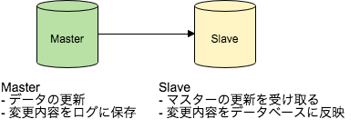

# Replication Topology

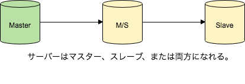

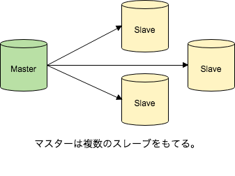

# Replication 参照性能の向上

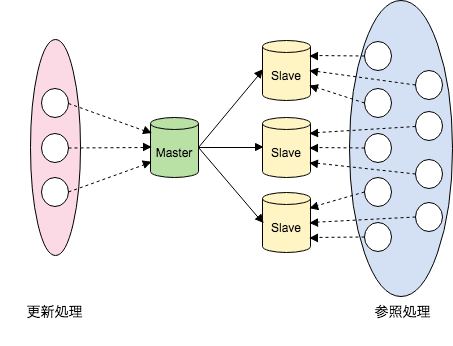

スレーブを増やし負荷分散を行う


# MySQL InnoDB Cluster

# MySQL InnoDB Cluster

3つのコンポーネントを組み合わせて作るMySQLの高可用性構成。

# MySQL InnoDB Cluster

構成要素
:   - MySQL Group Replication
    - MySQL Router
    - MySQL Shell


# MySQL InnoDB Cluster

特徴
:	- 簡易なセットアップ
	- 自動フェイルオーバー
	- マスタの自動昇格
	- M/Sの接続自動切り替え
	- 容易なスケールアップ

# MySQL InnoDB Cluster

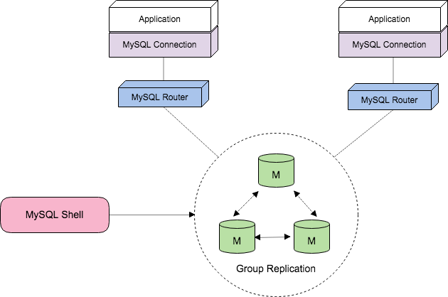


# MySQL Group Replication

# MySQL Group Replication


- フェイルオーバーが自動化
- 構成の拡張・縮小が容易
- 単一障害点がない
- 自動再構成

MySQL 5.7.17 以降で利用可能

# MySQL Group Replication

全ノードがマスターで等価の関係のグループを構成
MySQL側でのフェイルオーバー処理が不要

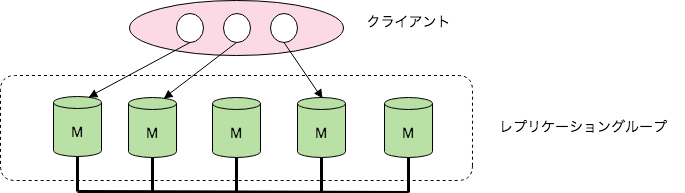

# MySQL Group Replication

全ノードがマスターで等価の関係のグループを構成
MySQL側でのフェイルオーバー処理が不要

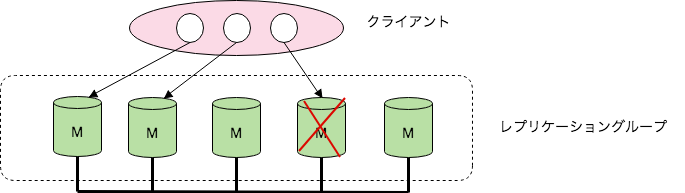

# MySQL Group Replication

シングルプライマリモード

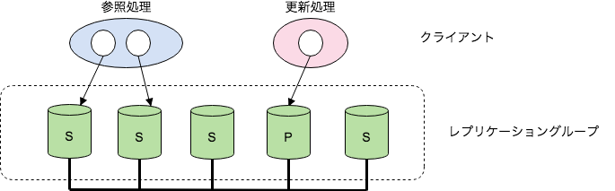

- Primary: 更新できるマスタ
- Secondary: 参照およびスタンバイ

# MySQL Group Replication

シングルプライマリモード

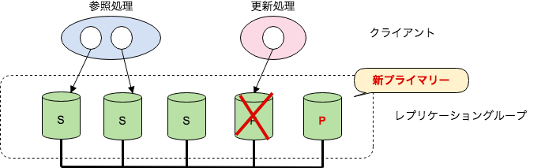

- プライマリーに障害があれば別インスタンスが昇格

# MySQL Group Replication

シングルプライマリモード

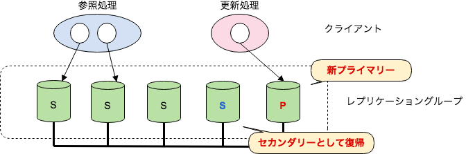

- セカンダリーとして復帰

# MySQL Router


# MySQL Router

- MySQL Connectionの振り分け
- ラウンドロビン
- 自動検出
- メタデータ・キャッシュ

# MySQL Router

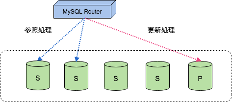

- 設定、メタデータに基づき接続

# MySQL Router

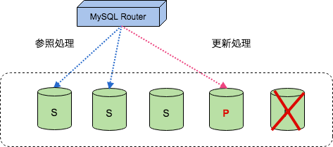

- メタデータを更新し参照先を変える


# MySQL Shell


# MySQL Shell

MySQL運用管理のためのCLIツール

- JavaScript, Python, and SQL
- 開発と管理用に完全なAPIを提供
- バッチ処理の実行


# MySQL Shell

MySQL InnoDB Cluster 管理用API

- クラスター作成
- MySQLインスタンスの構築
- クラスターの状況を確認可能
- MySQLインスタンスの開始・停止
- MySQLインスタンスの検証 ...

# Demo

# Demo

Vagrant で仮想マシンを使う

- MySQL
- MySQL Router
- MySQL Shell

インストールする

# Demo

/usr/local に配置

```
# groupadd mysql
# useradd -r -g mysql -s /bin/false mysql
#
# tar zxvf mysql-5.7.21-linux-glibc2.12-x86_64.tar.gz
# tar zxvf mysql-router-2.1.6-linux-glibc2.12-x86-64bit.tar.gz
# tar zxvf mysql-shell-1.0.11-linux-glibc2.12-x86-64bit.tar.gz
#
# ln -s ./mysql-5.7.21-linux-glibc2.12-x86_64 ./mysql
# ln -s ./mysql-router-2.1.6-linux-glibc2.12-x86-64bit ./mysqlrouter
# ln -s ./mysql-shell-1.0.11-linux-glibc2.12-x86-64bit ./mysqlshell
```

# Demo

PATHを通す

```
/usr/local/mysql/bin
/usr/local/mysqlshell/bin
/usr/local/mysqlrouter/bin
```

# Demo

MySQL Shellを使って環境構築

```
# sudo -i mysqlsh

mysql-js> dba.deploySandboxInstance(3310)
mysql-js> dba.deploySandboxInstance(3320)
mysql-js> dba.deploySandboxInstance(3330)

```

`/root` にSandboxが作られる

# Demo

MySQL Shellを使って環境構築
各インスタンスに接続

```
$ mysql -u root -p -h 127.0.0.1 -P3310 --prompt="mysql-\p>"
$ mysql -u root -p -h 127.0.0.1 -P3320 --prompt="mysql-\p>"
$ mysql -u root -p -h 127.0.0.1 -P3330 --prompt="mysql-\p>"
```

# Demo

Group Replication の設定

```
mysql-js> shell.connect('root@localhost:3310')

mysql-js> cluster = dba.createCluster('mycluster')
```

- クラスターの作成
- シングルプライマリモード

# Demo

Group Replication の設定

```
mysql-js> cluster.addInstance('root@localhost:3320')

mysql-js> cluster.addInstance('root@localhost:3330')
```

- クラスターにインスタンスを追加

# Demo

Group Replication の設定完了

```
create database tech_db;

create table member (
  `id` int auto_increment,
  `name` varchar(64) default null,
  `score` float default 0
);
```

プライマリーに変更を加えてみよう

# Demo

MySQL Router の設定

- /work で作成
- mysql ユーザーに書き込み権限が必要

```
# cd work
#
# mysqlrouter --bootstrap localhost:3310 --user=mysql --directory myrouter
```


# Demo

MySQL Router の起動

```
# myrouter/start.sh
```

# Demo

MySQL Router の設定ファイル

```
# cat mysqlrouter.conf
~~~
[metadata_cache:mycluster]
router_id=1
bootstrap_server_addresses=mysql://localhost:3310,mysql://localhost:3320,mysql://localhost:3330
user=mysql_router1_rmh5z6v6t93g
metadata_cluster=mycluster
ttl=300
~~~
```

# Demo

自動フェイルオーバーを試す

- 3310 インスタンスを落とす
- 3320 が自動昇格
- ルーター経由で接続が切り替わる
- データを更新する
- 3330 に反映される

# Demo

自動フェイルオーバーを試す

- 3310 をクラスターに戻す
- 3310 がセカンダリーになる
- 3310 のデータが更新される

# おしまい
