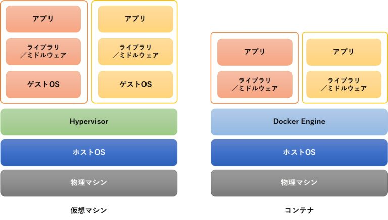

# Dockerを使った可視化環境の作り方

subtitle
:   はんなりPython+PyData Osakaの可視化特集

date
:   2019/03/24

author
:   @masayuki14

theme
:   blue-bar

allotted-time
:   20m

# 自己紹介

- もりさきまさゆき(Masa)

- @masayuki14

{: relative_width='60' relative_margin_top='25'}


{:.center}
**Follow me !!**


## プロパティ

background-image
:   ../assets/icon.jpg

background-image-relative-width
:   30

background-image-align
:   right

background-image-vertical-align
:   top

background-image-relative-margin-right
:   3

background-image-relative-margin-top
:   30

background-image-opacity
:   0.5

# 自己紹介

- プロ主夫
    - フリーランス {::note} (Web系パートタイム) {:/note}
    - データベーススペシャリスト

- コミュニティ
    - はんなりPython {::note} (第3金曜開催@京都) {:/note}
    - OSS Gate {::note} (京都, 大阪, 東京) {:/note}

- スプーキーズアンバサダー

# スプーキーズ@京都

- ボードゲーム制作
- Web系システム
- ソーシャルゲーム開発

{:.center}
**Webエンジニア積極採用中！！**

## プロパティ

background-image
:   ../assets/spookies_logo.png

background-image-relative-width
:   30

background-image-align
:   right

background-image-relative-margin-right
:   3

{::comment}
{:/comment}


# スプーキーズ@京都


もくもく会 [モクモクモック](https://spookies.connpass.com/event/123996/)

- 2019/03/28
    - モクモクモック（末木会）#6

勉強会 [テクテクテック](https://goo.gl/hXXafu)

- 2019/04/10
    - テクテクテック #8 サーバ監視や負荷テストどうやってるの？

## プロパティ

background-image
:   ../assets/spookies_logo.png

background-image-relative-width
:   30

background-image-align
:   right

background-image-relative-margin-right
:   3

{::comment}
{:/comment}


# Dockerを使った可視化環境の作り方

# Dockerを使った可視化環境の作り方

1. Docker環境までの道のり
1. Docker環境の紹介

# Dockerを使った可視化環境の作り方

1. *Docker環境までの道のり*
1. Docker環境の紹介

# Docker環境までの道のり

- 可視化アプリをつくろう!!
- 困ったことがたくさん
- できることから少しずつ
- Dockerで開発環境ができてた


# 可視化アプリを作ろう！

- ハンズオンでDash
- 簡単にできそう
- 興味のあるデータがない
- 懇親会でわいわい
- アイデアが降りてきた

# 遊園地の待ち時間を可視化しよう！

# USJ！TDL！TDS！

## property


background-image
:   ../assets/amusement-park-blue-sky-carnival-1376407.jpg

background-image-relative-width
:   100


# 可視化アプリを作ろう！

\\n
というわけで
待ち時間可視化アプリの
開発を始めるが・・・。

# Python 難しい

## property

background-image
:   ../assets/alone-benches-blue-jeans-1134204.jpg

background-image-relative-width
:   100


# 困ること多すぎ

## property

background-image
:   ../assets/alone-benches-blue-jeans-1134204.jpg

background-image-relative-width
:   100


# ところでぼくの基本スペック

- プログラミング
    - 10年以上
- Pythonコミュニティ
    - 1年ちょっと
- Python
    - 3ヶ月

# 困ったこがたくさん

- 環境どうしよう
    - MacのプリインストールPython
    - Dashのためのライブラリ
    - PC汚したくない
    - pyenv venv わからん

# 困ったこがたくさん

- Python慣れてない
    - やりたいことがすぐできないストレス
    - ライブラリ知らない
    - 書きながら動かしたい

# 困ったこがたくさん

- Pandas慣れてない
    - CSVはあるけど目的の形にできない
    - データ操作のストレスが爆発
    - 処理が重い
    - データだけみたい時こまる

# 困ったこがたくさん

- PC2台
    - デスクトップ
    - ラップトップ
    - 環境揃えたい

# なんとかならんか

## property

background-image
:   ../assets/action-plan-brainstorming-complex-212286.jpg

background-image-relative-width
:   100


# 近道はない

## property

background-image
:   ../assets/argument-bench-breakup-984949.jpg

background-image-relative-width
:   100

# こつこつやるしかない

## property

background-image
:   ../assets/adventure-backpacker-climb-1365425.jpg

background-image-relative-width
:   100


# できることから少しずつ

環境どうしよう
:   - **Docker使おう!!**
    - 使い捨てでいいや
    - バージョンとか気にしなくていい
    - PC汚れない

# できることから少しずつ

Python慣れてない
:   - *JupyterNotebook!!*
    - 書いて動かすを繰り返す
    - 試行錯誤を保存

# できることから少しずつ

Pandasなれてない
:   - **MySQLでやる!!**
    - 慣れてる
    - Pandasは最低限
    - そのうち慣れるやろう


# できることから少しずつ

PC2台
:   - **docker-compose.yml**
    - Infra as a code
    - 宣言的な記述で管理
    - リポジトリで共有

# 基本にある考え

- ゴール重視
    - 可視化アプリが動くこと
- できること重視
    - Pandas覚えたいわけじゃない
- 射撃しつつ前進
    - Joel on Software 読んでくれ

# Joel on Software


# こつこつ進めた結果

# Docker環境のできあがり

## property

background-image
:   ../assets/business-commerce-container-379964.jpg

background-image-relative-width
:   100


# Dockerを使った可視化環境の作り方

1. Docker環境までの道のり
1. *Docker環境の紹介*


# Dockerとは

{: relative_width='90' }

{:.center}
{::note}引用元: https://knowledge.sakura.ad.jp/13265/{:/note}


# Dockerとは

- 仮想環境とかよくわからん

# Dockerとは

- コンピュータの中に箱を用意
- 必要なものを詰め込む
- いい感じにつかう
- はんなりPythonに来て
    - たまに使うから

# できあがったDocker環境

```

+--------+       +-------+        +---------+
|        |       |       |        |         |
|  Dash  | ----- | MySQL | ------ | Jupyter |
|        |       |       |        |         |
+--------+       +-------+        +---------+
                     |
                     |            +---------+
                     |            |         |
                     +----------- | adminer |
                                  |         |
                                  +---------+
```

# Dockerfile

```
FROM python:3.7

# for dash
RUN pip install dash==0.36.0
RUN pip install dash-html-components==0.13.5
RUN pip install dash-core-components==0.43.0
RUN pip install dash-table==3.1.11
RUN pip install dash-daq==0.1.0

RUN pip install pandas
RUN pip install mysql-connector-python==8.0.15

RUN export LANG=ja_JP.UTF-8
```
{: lang="dockerfile" }


# docker-compose.yml

```
version: '3.7'
services:
  dash:
    build:
      context: ./dockerfiles
      dockerfile: Dockerfile.dash
    command: ["python", "/work/dash/app.py"]
    working_dir: /work
    depends_on:
      - db
    volumes:
      - ./:/work
      - ./logwh:/log
    ports:
      - 8050:8050
```
{: lang="yaml" }


# docker-compose.yml

```
  db:
    image: mysql:8.0
    command:
      - --default-authentication-plugin=mysql_native_password
      - --secure-file-priv=/log
    restart: always
    environment:
      MYSQL_ROOT_PASSWORD: root
      MYSQ_DATABASE: disney
    ports:
      - 3306:3306
    working_dir: /work
    volumes:
      - ./db/mysql/datadir:/var/lib/mysql
      - ./db/mysql/log:/var/log/mysql

```
{: lang="yaml" }


# Infra as a Code

- Dockerfile
- docker-compose.yml
- etc...

環境を再現しやすくなる

# Demo

https://github.com/...


# まとめ

- Dockerを使って問題解決！
- 可視化関係なかった！
- はんなりPython来てね

# ありがとうございました
