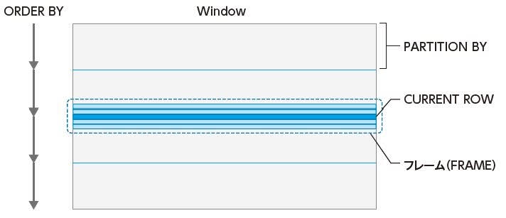
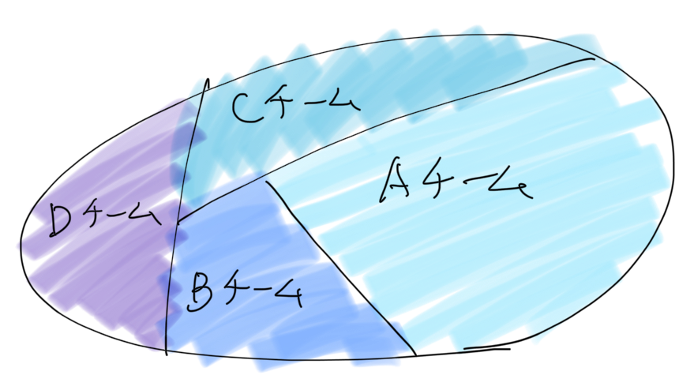

# 君はWindow関数を知っているか！？

subtitle
:   テクテクテック#7 DB勉強会

date
:   2019/01/16

author
:   @masayuki14

theme
:   clear-blue

allotted-time
:   10m

set_background("red")

# 目次

- 自己紹介
- Window関数とは
- 実践Window関数
- まとめ


# 自己紹介

- もりさきまさゆき

- @masayuki14

{: relative_width='60' align='left'}


{:.center}
**Follow me !!**


## プロパティ

background-image
:   icon.jpg

background-image-relative-width
:   30

background-image-align
:   right

background-image-relative-margin-right
:   3

background-image-opacity
:   0.5

# 自己紹介

- プロ主夫
    - 妻1人 {::note} (フルタイム) {:/note} 幼児2人
    - フリーランス {::note} (Web系パートタイム) {:/note}
    - データベーススペシャリスト

- コミュニティ
    - はんなりPython {::note} (第3金曜開催@京都) {:/note}
    - OSS Gate {::note} (京都, 大阪, 東京) {:/note}

- スプーキーズアンバサダー

# スプーキーズ@京都

- Web系システム
- ソーシャルゲーム開発
- ボードゲーム制作

{:.center}
**Webエンジニア積極採用中！！**

## プロパティ

background-image
:   spookies_logo.png

background-image-relative-width
:   30

background-image-align
:   right

background-image-relative-margin-right
:   3

{::comment}
{:/comment}


# スプーキーズ@京都

勉強会 [テクテクテック](https://goo.gl/hXXafu)

- 2019/04/10
    - サーバ監視や負荷テストどうやってるの？
- もくもく会はじめました
    - 2/28(木) 19:00〜
    - いつでも来てね!!

## プロパティ

background-image
:   spookies_logo.png

background-image-relative-width
:   30

background-image-align
:   right

background-image-relative-margin-right
:   3

{::comment}
{:/comment}


# Window関数とは

{:.center}
{::tag name="x-large"} Window関数とは {:/tag}

# Window関数とは

{::tag name="large"} 標準SQL規格 {:/tag}
{::tag name="large"} SQL:2003にて追加された {:/tag}
{::tag name="large"} 標準機能 {:/tag}

# Window関数とは

{::tag name="large"} MySQL8.0でサポート {:/tag}
{::tag name="large"} 主要RDBMSで利用可能 {:/tag}

- Oracle, SQL Server
- PostgreSQL, MySQL

# Window関数とは

{:.center}
{::tag name="x-large"} Window関数とは {:/tag}

# Window関数とは

{::tag name="x-large"} Window + 関数 ??  {:/tag}

# Window関数とは

{::tag name="large"} Window の意味は？ {:/tag}
:   - {::tag name="x-large"}×  窓 {:/tag}
    - {::tag name="x-large"}○  範囲 幅 {:/tag}

# Window関数とは

{::tag name="large"} 範囲を指定して {:/tag}
:   - {::tag name="large"} 違う行を自分の行にもってくる {:/tag}
    - {::tag name="large"} 集約結果を自分の行にもってくる {:/tag}

# Window関数とは

{::tag name="x-large"} どうやって範囲を指定する？ {:/tag}

# Window関数とは

{::tag name="x-large"} Window関数を使って {:/tag}

# Window関数とは

{::tag name="x-large"} SQLを見てみよう {:/tag}

# Window関数とは

Window関数を使ったSQLの例

```
SELECT
    customer_id,
    amount,
    RANK() OVER (
        PARTITION BY customer_id
        ORDER BY amount DESC) AS rk
FROM payment;
```
{: lang="sql" }

# Window関数とは

実はこれの省略形(名前付き構文)

```
SELECT
    customer_id,
    amount,
    RANK() OVER w AS rk
FROM payment
WINDOW w AS (PARTITION BY customer_id
             ORDER BY amount DESC);
```
{: lang="sql" }

# Window関数とは

Windowの使い回し

```
SELECT
    customer_id,
    amount,
    RANK()       OVER w AS rk,
    MAX(amount)  OVER w AS max
FROM payment
WINDOW w AS (PARTITION BY customer_id
             ORDER BY amount DESC);
```
{: lang="sql" }

# Window関数とは

Window関数の書き方

```
SELECT
    集約関数() OVER (範囲指定)
FROM table
```
{: lang="sql" }

`OVER()` があればWindow関数

# Window関数とは

Window関数の書き方

集約関数
:   - ROW_NUMBER(), FIRST_VALUE()
    - MAX(), MIN(), AVG()

範囲指定
:   - PARTITION BY, ORDER BY
    - フレーム句

# Window関数とは

{: relative_width='100' }

{:.center}
> {::tag name="xx-small"} 1枚でわかるWindow関数 - https://codezine.jp/article/detail/11115 {:/tag}

# Window関数とは

Window関数の3つの機能

- PARTITION BY 句によるレコード集合の分割
- ORDER BY 句によるレコードの順序づけ
- フレーム句によるカレントレコードを中心としたサブセット定義

# 実践Window関数

{:.center}
{::tag name="x-large"} 実践Window関数 {:/tag}

# 実践Window関数

{::tag name="x-large"} まずはPARTITION BY を {:/tag}
{::tag name="x-large"} おさえよう {:/tag}

# 実践Window関数

{::tag name="xx-small"} 単純な例 {:/tag}

```
teams table
+-----------+------+------+
| member    | team | age  |
+-----------+------+------+
| 富士崎    | A    |   39 |
| 西塚      | A    |   45 |
| 西崎      | A    |   24 |
| 逸見      | B    |   26 |
| 岡村      | B    |   18 |
| 東野      | C    |   50 |
| 各務原    | D    |   27 |
| 犬山      | D    |   28 |
| 鳥羽      | D    |   33 |
| 桃山      | D    |   28 |
+-----------+------+------+
```

# 実践Window関数

{::tag name="xx-small"} team ごとに分割して行番号を取得する {:/tag}

```
SELECT
    member,
    team,
    age,
    ROW_NUMBER() OVER (
        PARTITION BY team
        ORDER BY age) AS num
FROM teams;
```
{: lang="sql" }


# 実践Window関数

{::tag name="xx-small"} team ごとに分割して行番号を取得する {:/tag}

```
+-----------+------+------+-----+
| member    | team | age  | num |
+-----------+------+------+-----+
| 西崎      | A    |   24 |   1 |
| 富士崎    | A    |   39 |   2 |
| 西塚      | A    |   45 |   3 |
| 岡村      | B    |   18 |   1 |
| 逸見      | B    |   26 |   2 |
| 東野      | C    |   50 |   1 |
| 各務原    | D    |   27 |   1 |
| 桃山      | D    |   28 |   2 |
| 犬山      | D    |   28 |   3 |
| 鳥羽      | D    |   33 |   4 |
+-----------+------+------+-----+
```

# 実践Window関数

{::tag name="xx-small"} team ごとに分割して順位を取得する {:/tag}

```
SELECT
    member,
    team,
    age,
    RANK() OVER (
        PARTITION BY team
        ORDER BY age) AS rk
FROM teams;
```
{: lang="sql" }


# 実践Window関数

{::tag name="xx-small"} team ごとに分割して順位を取得する {:/tag}

```
+-----------+------+------+----+
| member    | team | age  | rk |
+-----------+------+------+----+
| 西崎      | A    |   24 |  1 |
| 富士崎    | A    |   39 |  2 |
| 西塚      | A    |   45 |  3 |
| 岡村      | B    |   18 |  1 |
| 逸見      | B    |   26 |  2 |
| 東野      | C    |   50 |  1 |
| 各務原    | D    |   27 |  1 |
| 犬山      | D    |   28 |  2 |
| 桃山      | D    |   28 |  2 |
| 鳥羽      | D    |   33 |  4 |
+-----------+------+------+----+
```

# 実践Window関数

PARTITION BY で部分集合を作って
その中で集約関数使う

{: relative_width='60' }

# 実践Window関数

{::tag name="xx-small"} 少し込み入った例 {:/tag}

```
records table
+------+------------+---------+--------+------------+
| team | competitor | score   | is_win | played_at  |
+------+------------+---------+--------+------------+
| A    | B          | 10 - 3  |      1 | 2018-11-20 |
| A    | C          | 10 - 8  |      1 | 2018-11-24 |
| A    | B          | 8 - 5   |      1 | 2018-10-05 |
| A    | D          | 3 - 9   |      0 | 2018-09-28 |
| A    | C          | 4 - 5   |      0 | 2018-12-04 |
| A    | B          | 7 - 9   |      0 | 2018-11-05 |
| A    | D          | 20 - 17 |      1 | 2018-12-06 |
| A    | D          | 12 - 11 |      0 | 2018-10-14 |
| A    | B          | 8 - 4   |      1 | 2018-09-23 |
| A    | E          | 8 - 0   |      1 | 2018-12-28 |
| A    | E          | 6 - 0   |      1 | 2019-01-06 |
+------+------------+---------+--------+------------+
```

# 実践Window関数

{::tag name="xx-small"} チームごとに対戦成績をみたい {:/tag}

```
SELECT
    *
FROM
    records
ORDER BY
    competitor, played_at;
```
{: lang="sql" }


# 実践Window関数

{::tag name="xx-small"} チームごとに対戦成績をみたい {:/tag}

```
+------+------------+---------+--------+------------+
| team | competitor | score   | is_win | played_at  |
+------+------------+---------+--------+------------+
| A    | B          | 8 - 4   |      1 | 2018-09-23 |
| A    | B          | 8 - 5   |      1 | 2018-10-05 |
| A    | B          | 7 - 9   |      0 | 2018-11-05 |
| A    | B          | 10 - 3  |      1 | 2018-11-20 |
| A    | C          | 10 - 8  |      1 | 2018-11-24 |
| A    | C          | 4 - 5   |      0 | 2018-12-04 |
| A    | D          | 3 - 9   |      0 | 2018-09-28 |
| A    | D          | 12 - 11 |      0 | 2018-10-14 |
| A    | D          | 20 - 17 |      1 | 2018-12-06 |
| A    | E          | 8 - 0   |      1 | 2018-12-28 |
| A    | E          | 6 - 0   |      1 | 2019-01-06 |
+------+------------+---------+--------+------------+
```

# 実践Window関数

{::tag name="xx-small"} チームごとに**最新の**対戦成績をみたい {:/tag}

```
SELECT
    team, competitor,
    score, is_win, played_at,
    ROW_NUMBER() OVER (
        PARTITION BY competitor
        ORDER BY played_at DESC
    ) AS rn
FROM
    records;
```
{: lang="sql" }


# 実践Window関数

{::tag name="xx-small"} チームごとに**最新の**対戦成績をみたい {:/tag}

```
+------+------------+---------+--------+------------+----+
| team | competitor | score   | is_win | played_at  | rn |
+------+------------+---------+--------+------------+----+
| A    | B          | 10 - 3  |      1 | 2018-11-20 |  1 |
| A    | B          | 7 - 9   |      0 | 2018-11-05 |  2 |
| A    | B          | 8 - 5   |      1 | 2018-10-05 |  3 |
| A    | B          | 8 - 4   |      1 | 2018-09-23 |  4 |
| A    | C          | 4 - 5   |      0 | 2018-12-04 |  1 |
| A    | C          | 10 - 8  |      1 | 2018-11-24 |  2 |
| A    | D          | 20 - 17 |      1 | 2018-12-06 |  1 |
| A    | D          | 12 - 11 |      0 | 2018-10-14 |  2 |
| A    | D          | 3 - 9   |      0 | 2018-09-28 |  3 |
| A    | E          | 6 - 0   |      1 | 2019-01-06 |  1 |
| A    | E          | 8 - 0   |      1 | 2018-12-28 |  2 |
+------+------------+---------+--------+------------+----+
```

# 実践Window関数

{::tag name="xx-small"} チームごとに**最新の**対戦成績をみたい {:/tag}

```
SELECT * FROM (
    SELECT
        team, competitor,
        score, is_win, played_at,
        ROW_NUMBER() OVER (
            PARTITION BY competitor
            ORDER BY played_at DESC
        ) AS rn
    FROM
        records
) tbl
WHERE rn = 1;
```
{: lang="sql" }

# 実践Window関数

{::tag name="xx-small"} チームごとに**最新の**対戦成績をみたい {:/tag}

```
+------+------------+---------+--------+------------+----+
| team | competitor | score   | is_win | played_at  | rn |
+------+------------+---------+--------+------------+----+
| A    | B          | 10 - 3  |      1 | 2018-11-20 |  1 |
| A    | C          | 4 - 5   |      0 | 2018-12-04 |  1 |
| A    | D          | 20 - 17 |      1 | 2018-12-06 |  1 |
| A    | E          | 6 - 0   |      1 | 2019-01-06 |  1 |
+------+------------+---------+--------+------------+----+
```

# 実践Window関数

{::tag name="large"} Window関数を使うことで {:/tag}
{::tag name="large"} 部分集合の結果を {:/tag}
{::tag name="large"} 自分の行に持って来ることができる {:/tag}

# 実践Window関数

{::tag name="x-large"} 実践Window関数 {:/tag}

# 実践Window関数

{::tag name="x-large"} フレーム句を使い {:/tag}
{::tag name="x-large"} 違う行を持ってくる {:/tag}

# 実践window関数

売上データ

```
sales table
+------------+-------+
| date       | sales |
+------------+-------+
| 2019-01-01 |  1930 |
| 2019-01-02 |  2030 |
| 2019-01-05 |  1720 |
| 2019-01-07 |  2290 |
| 2019-01-08 |  1660 |
| 2019-01-10 |  2450 |
+------------+-------+
```

# 実践Window関数

{::tag name="xx-small"} 過去の直近の日付を取得する {:/tag}

```
SELECT
    date AS cur_date,
    sales AS cur_sales,
    MIN(date) OVER (
        ORDER BY date
        ROWS BETWEEN 1 PRECEDING AND 1 PRECEDING
    ) AS latest_date
FROM sales;
```
{: lang="sql" }

# 実践Window関数

{::tag name="xx-small"} 過去の直近の日付を取得する {:/tag}

```
+------------+-----------+-------------+
| cur_date   | cur_sales | latest_date |
+------------+-----------+-------------+
| 2019-01-01 |      1930 | NULL        |
| 2019-01-02 |      2030 | 2019-01-01  |
| 2019-01-05 |      1720 | 2019-01-02  |
| 2019-01-07 |      2290 | 2019-01-05  |
| 2019-01-08 |      1660 | 2019-01-07  |
| 2019-01-10 |      2450 | 2019-01-08  |
+------------+-----------+-------------+
```

# 実践Window関数

{::tag name="xx-small"} 過去の直近の日付と売上を取得する {:/tag}

```
SELECT
    date AS cur_date,
    sales AS cur_sales,
    MIN(date)  OVER W AS latest_date,
    MIN(sales) OVER W AS latest_sales
FROM sales
WINDOW W AS (
    ORDER BY date
    ROWS BETWEEN 1 PRECEDING AND 1 PRECEDING
);
```
{: lang="sql" }

# 実践Window関数

{::tag name="xx-small"} 過去の直近の日付と売上を取得する {:/tag}

```
+------------+-----------+-------------+--------------+
| cur_date   | cur_sales | latest_date | latest_sales |
+------------+-----------+-------------+--------------+
| 2019-01-01 |      1930 | NULL        |         NULL |
| 2019-01-02 |      2030 | 2019-01-01  |         1930 |
| 2019-01-05 |      1720 | 2019-01-02  |         2030 |
| 2019-01-07 |      2290 | 2019-01-05  |         1720 |
| 2019-01-08 |      1660 | 2019-01-07  |         2290 |
| 2019-01-10 |      2450 | 2019-01-08  |         1660 |
+------------+-----------+-------------+--------------+
```

# 実践Window関数

{::tag name="xx-small"} 1日前の売上を取得する {:/tag}

```
SELECT
    date AS cur_date,
    sales AS cur_sales,
    MIN(date)  OVER W AS latest_date,
    MIN(sales) OVER W AS latest_sales
FROM sales
WINDOW W AS (
    ORDER BY date
    RANGE BETWEEN INTERVAL 1 day PRECEDING
        AND INTERVAL 1 day PRECEDING
);
```
{: lang="sql" }


# 実践Window関数

{::tag name="xx-small"} 1日前の売上を取得する {:/tag}

```
+------------+-----------+-------------+--------------+
| cur_date   | cur_sales | latest_date | latest_sales |
+------------+-----------+-------------+--------------+
| 2019-01-01 |      1930 | NULL        |         NULL |
| 2019-01-02 |      2030 | 2019-01-01  |         1930 |
| 2019-01-05 |      1720 | NULL        |         NULL |
| 2019-01-07 |      2290 | NULL        |         NULL |
| 2019-01-08 |      1660 | 2019-01-07  |         2290 |
| 2019-01-10 |      2450 | NULL        |         NULL |
+------------+-----------+-------------+--------------+
```

# 実践Window関数

{::tag name="xx-small"} 2日後の売上を取得する {:/tag}

```
SELECT
    date AS cur_date,
    sales AS cur_sales,
    MIN(date)  OVER W AS latest_date,
    MIN(sales) OVER W AS latest_sales
FROM sales
WINDOW W AS (
    ORDER BY date
    RANGE BETWEEN INTERVAL 2 day FOLLOWING
        AND INTERVAL 2 day FOLLOWING
);
```
{: lang="sql" }


# 実践Window関数

{::tag name="xx-small"} 2日後の売上を取得する {:/tag}

```
+------------+-----------+-------------+--------------+
| cur_date   | cur_sales | latest_date | latest_sales |
+------------+-----------+-------------+--------------+
| 2019-01-01 |      1930 | NULL        |         NULL |
| 2019-01-02 |      2030 | NULL        |         NULL |
| 2019-01-05 |      1720 | 2019-01-07  |         2290 |
| 2019-01-07 |      2290 | NULL        |         NULL |
| 2019-01-08 |      1660 | 2019-01-10  |         2450 |
| 2019-01-10 |      2450 | NULL        |         NULL |
+------------+-----------+-------------+--------------+
```

# 実践Window関数

{::tag name="large"} フレーム句を使うと {:/tag}
{::tag name="large"} 違う行を現在の行にもってくることができる {:/tag}


# 実践Window関数

フレーム句で利用するキーワード
:   - **ROWS**: 行単位で移動する
    - **RANGE**: 列の値で移動する ORDER BY 句の列
    - **n PRECEDING**: n だけ前へ移動
    - **n FOLLOWING**: n だけ後ろへ移動
    - **CURRENT ROW**: 現在行

# 実践Window関数

応用例
:   - 前日との売上を比較
    - 3日間の移動平均
    - チームごとの平均勝率

# まとめ

{:.center}
{::tag name="x-large"} まとめ {:/tag}

# まとめ

Window 関数でできること
:   - 部分集合の値を持ってくる
    - 違う行の値を持ってくる

わかりにくいサブクエリーにさよなら

# まとめ

{:.center}
{::tag name="x-large"} ありがとうございました {:/tag}

